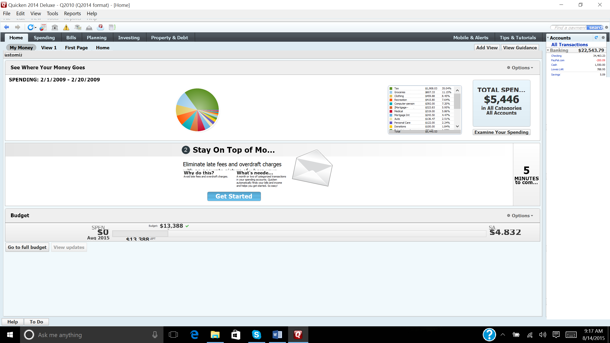
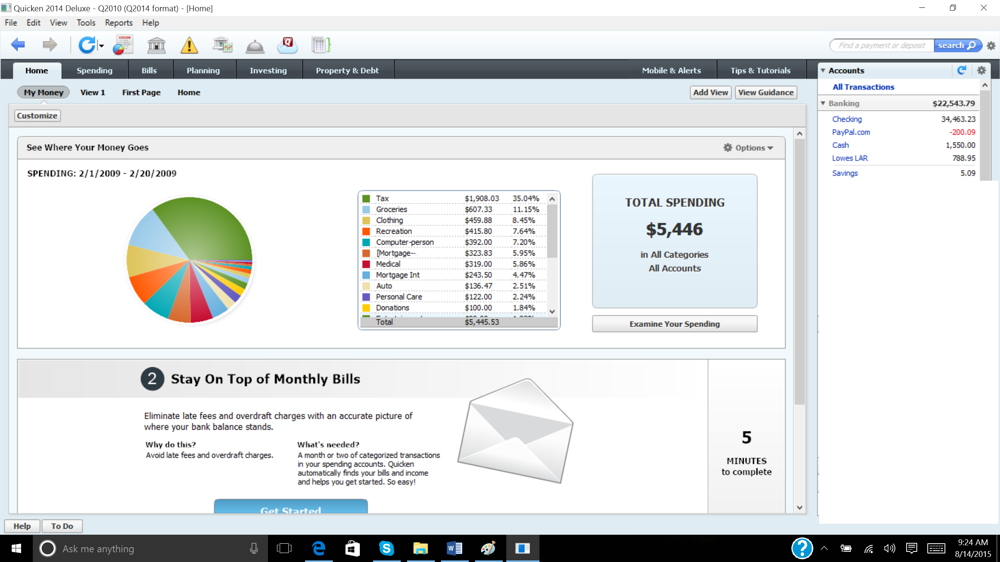
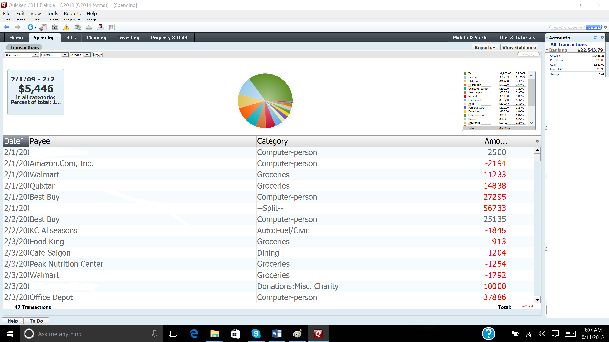
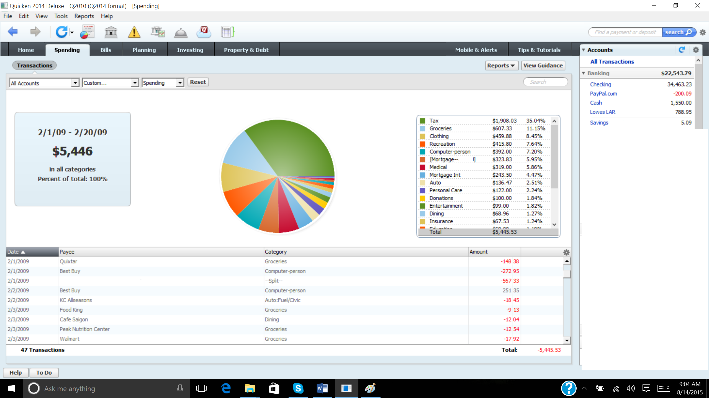

# QWLaunch #

Many Quicken® software versions do not fully support high DPI settings in
Windows®.  (These are the settings in **Display** in **Control Panel** that
allow you to pick 100%, 125%, 150%, 200%, etc. scaling).  Quicken claims to
properly support this DPI scaling setting, but as many Quicken users can attest,
this is not always so.

As a compatibility workaround, this program will disable DPI awareness for
Quicken.  Disabling DPI awareness causes Windows to enable DPI virtualization
for Quicken.  Essentially, Windows will lie to Quicken and get Quicken to
render itself at the standard 100% scaling setting.  Then, Windows will upscale
the image to your chosen scaling setting.  The result works well at the cost of
blurry text and images.

## Screenshots ##

These screenshots were taken with Quicken 2014 on Windows 10.  The screen
resolution was 2560x1440 pixels and the DPI was set to 175% of normal (i.e.
168 DPI).

**Quicken 2014 Home screen, before using QWLaunch:**

Notice the following problems, among many others:

* The **Customize** button in the upper-left corner is cropped.
* The **Stay On Top of Monthly Bills** section is severely distorted.
* The budget is completely unintelligible.
* The menu bar has a weird "ghost" area underneath it.
* Numerous items appear to be too small and weren't properly grown in size.

**Quicken 2014 Home screen, running with QWLaunch:**

**Quicken 2014 Spending screen, before using QWLaunch:**

Notice the following problems, among many others:

* The pie chart is too small.
* The spending amounts to the right of the pie chart are microscopic.
* The labels to the left of the pie chart are cropped.
* Numerous items that should have been grown in size, but weren't.

**Quicken 2014 Spending screen, running with QWLaunch:**

## Required Build Tools ##

* Visual C#® 2010 or newer (Express versions work fine).  You should target the
  same version of Microsoft .NET Framework as Quicken does (currently 4.0).

## Build Instructions ##

1. Build the `QWLaunch.sln` solution.  Use the `Release` configuration.

## Install Instructions ##

1. Copy the compiled `bin\Release\QWLaunch.exe` file to your main Quicken
   directory.  For example, on my 64-bit Windows computer with Quicken installed
   to the default location, I'd copy it to `C:\Program Files
   (x86)\Quicken\QWLaunch.exe`.

1. Create a shortcut to the `QWLaunch.exe` file somewhere accessible (e.g. on
   your desktop and/or in your Start menu).

1. Use your shortcut to `QWLaunch.exe` any time you want to launch Quicken.

## Compatibility ##

This has been tested with Quicken 2014 and Quicken 2015.

## How QWLaunch Works ##

The technique is very simple.  Rather than directly load Quicken's main
`qw.exe`, we now use a wrapper program.  This wrapper program has a WPF
attribute set to disable DPI awareness.  It then loads the main Quicken program.
by loading the Quicken assembly and invoking its `Main` function - all in the
same process.

## References ##

* [DPI Virtualization and Scaling][1]
* [DisableDpiAwarenessAttribute Class][2]

[1]: https://msdn.microsoft.com/en-us/library/windows/desktop/dn469266(v=vs.85).aspx#dpi_virtualization_and_scaling
[2]: https://msdn.microsoft.com/en-us/library/system.windows.media.disabledpiawarenessattribute(v=vs.100).aspx

## Trademarks ##

Intuit and Quicken are trademarks and service marks of Intuit Inc., registered
in the United States and other countries.

Microsoft, Windows, and Visual C# are either registered trademarks or trademarks
of Microsoft Corporation in the United States and/or other countries.
